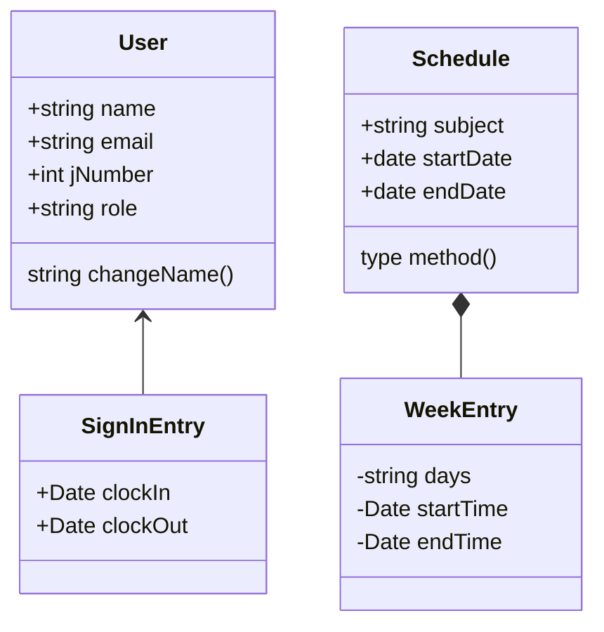
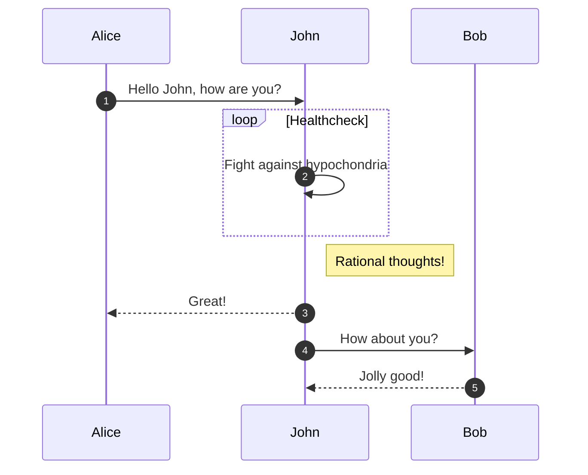

# Scholars-Academy-Overview

Object Model Diagram
- interface/transitional class
- Database 

```mermaid
 classDiagram

    User <-- SignInEntry
    Schedule *-- WeekEntry

    class User
    User: +string name 
    User: +string email
    User: +int jNumber
    User: +string role
    User: string changeName()

    class Schedule
    Schedule: +string subject
    Schedule: +date startDate
    Schedule: +date endDate
    Schedule: type method()  
    
    class WeekEntry
    WeekEntry: -string days 
    WeekEntry: -Date startTime 
    WeekEntry: -Date endTime 

    class SignInEntry
    SignInEntry: +Date clockIn
    SignInEntry: +Date clockOut


```

This is a sequence diagram 

```mermaid 
sequenceDiagram
    autonumber
    Alice->>John: Hello John, how are you?
    loop Healthcheck
        John->>John: Fight against hypochondria
    end
    Note right of John: Rational thoughts!
    John-->>Alice: Great!
    John->>Bob: How about you?
    Bob-->>John: Jolly good!

```
